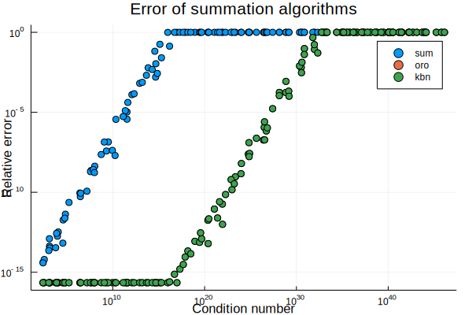
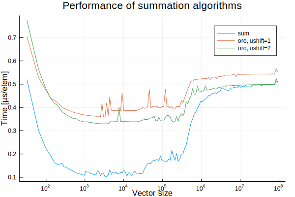

# AccurateArithmetic.jl
## Floating point math with error-free, faithful, and compensated transforms. 


[](https://travis-ci.org/JuliaMath/AccurateArithmetic.jl)


### Error-free and faithful transforms

`AccurateArithmetic.jl` provides a set of error-free transforms (EFTs), which
allow getting not only the rounded result of a floating-point computation, but
also the accompanying rounding error:

```julia
julia> using AccurateArithmetic

# WARNING: a is not really 1/10, as this value is not representable as a Float64
# (and similarly for b)
julia> (a, b) = (0.1, 0.2)

julia> (s, e) = AccurateArithmetic.two_sum(a, b)
(0.30000000000000004, -2.7755575615628914e-17)
```

In the above example, `s` is the result of the floating-point addition
`0.1+0.2`, rounded to the nearest representable floating-point number, exactly
what you would get from a standard addition. `e` is the rounding error
associated to `s`. In other words, it is guaranteed that a + b = s + e, in a
strict mathematical sense (i.e. when the `+` operate on real numbers and are not
rounded).

Similar EFTs are provided for the binary subtraction (`two_diff`) and
multiplication (`two_prod`). Some operations of higher arity are also supported,
such as `three_sum`, `four_sum` or `three_prod`.


### Compensated algorithms

EFTs can be leveraged to build "compensated algorithms", which compute a result
as if the basic algorithm had been run using a higher precision.

```julia

# By construction, this vector sums to 1
julia> x = 5000 |> N->randn(N) .* exp.(10 .* randn(N)) |> x->[x;-x;1.0] |> x->x[sortperm(rand(length(x)))];
julia> sum(big.(x))
1.0

# But the standard summation algorithms computes this sum very inaccurately
# (not even the sign is correct)
julia> sum(x)
-136.0


# Compensated summation algorithms should compute this more accurately
julia> using AccurateArithmetic

# Algorithm by Ogita, Rump and Oishi
julia> sum_oro(x)
0.9999999999999716

# Algorithm by Kahan, Babuska and Neumaier
julia> sum_kbn(x)
0.9999999999999716
```




In the graph above, we see the relative error vary as a function of the
condition number, in a log-log scale. Errors lower than ϵ are arbitrarily set to
ϵ; conversely, when the relative error is more than 100% (i.e no digit is
correctly computed anymore), the error is capped there in order to avoid
affecting the scale of the graph too much. What we see is that the pairwise
summation algorithm (as implemented in Base.sum) starts losing accuracy as soon
as the condition number increases, computing only noise when the condition
number exceeds 1ϵ≃1016. In contrast, both compensated algorithms
(Kahan-Babuska-Neumaier and Ogita-Rump-Oishi) still accurately compute the
result at this point, and start losing accuracy there, computing meaningless
results when the condition nuber reaches 1ϵ2≃1032. In effect these (simply)
compensated algorithms produce the same results as if a naive summation had been
performed with twice the working precision (128 bits in this case), and then
rounded to 64-bit floats.

<br/>

Performancewise, compensated algorithms perform a lot better than alternatives
such as arbitrary precision (`BigFloat`) or rational arithmetic (`Rational`) :

```julia
julia> using BenchmarkTools

julia> @btime sum($x)
  1.305 μs (0 allocations: 0 bytes)
-136.0

julia> @btime sum_oro($x)
  3.421 μs (0 allocations: 0 bytes)
0.9999999999999716

julia> @btime sum_kbn($x)
  3.792 μs (0 allocations: 0 bytes)
0.9999999999999716

julia> @btime sum(big.($x))
  874.203 μs (20006 allocations: 1.14 MiB)
1.0

julia> @btime sum(Rational{BigInt}.(x))
  22.702 ms (582591 allocations: 10.87 MiB)
1//1
```


However, compensated algorithms perform a larger number of elementary operations
than their naive floating-point counterparts. As such, they usually perform
worse. However, leveraging the power of modern architectures via vectorization,
the slow down can be kept to a small value.



In the graph above, the time spent in the summation (renormalized per element)
is plotted against the vector size (the units in the y-axis label should be
“ns/elem”). What we see with the standard summation is that, once vectors start
having significant sizes (say, more than 1000 elements), the implementation is
memory bound (as expected of a typical BLAS1 operation). Which is why we see
significant decreases in the performance when the vector can’t fit into the L2
cache (around 30k elements, or 256kB on my machine) or the L3 cache (around 400k
elements, or 3MB on y machine).

The Ogita-Rump-Oishi algorithm, when implemented with a suitable unrolling level
(ushift=2, i.e 22=4 unrolled iterations), is CPU-bound when vectors fit inside
the cache. However, when vectors are to large to fit into the L3 cache, the
implementation becomes memory-bound again (on my system), which means we get the
same performance as the standard summation.

In other words, the improved accuracy is free for sufficiently large
vectors. For smaller vectors, the accuracy comes with a slow-down that can reach
values slightly above 3 for vectors which fit in the L2 cache.


### Tests

The graphs above can be reproduced using the `test/perftests.jl` script in this
repository. Before running them, be aware that it takes around one hour to
generate the performance graph, during which the benchmark machine should be as
low-loaded as possible in order to avoid perturbing performance measurements.

### References

- T. Ogita, S. Rump and S. Oishi, "Accurate sum and dot product", SIAM Journal
  on Scientific Computing, 6(26), 2005. DOI: 10.1137/030601818
