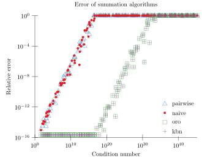
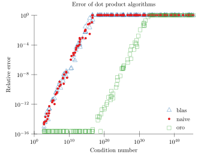
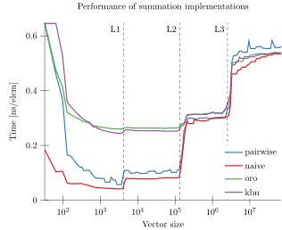
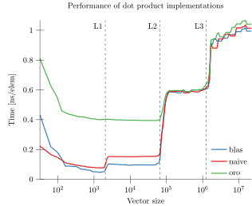

# AccurateArithmetic.jl
## Floating point math with error-free, faithful, and compensated transforms. 

[travis-img]: https://travis-ci.org/JuliaMath/AccurateArithmetic.jl.svg?branch=master
[travis-url]: https://travis-ci.org/JuliaMath/AccurateArithmetic.jl

[pkgeval-img]: https://juliaci.github.io/NanosoldierReports/pkgeval_badges/A/AccurateArithmetic.svg
[pkgeval-url]: https://juliaci.github.io/NanosoldierReports/pkgeval_badges/report.html


[![Build Status][travis-img]][travis-url]
[![PkgEval][pkgeval-img]][pkgeval-url]


### Error-free and faithful transforms

`AccurateArithmetic.jl` provides a set of error-free transforms (EFTs), which
allow getting not only the rounded result of a floating-point computation, but
also the accompanying rounding error:

```julia
julia> using AccurateArithmetic

# WARNING: a is not really 1/10, as this value is not representable as a Float64
# (and similarly for b)
julia> (a, b) = (0.1, 0.2)

julia> (s, e) = AccurateArithmetic.two_sum(a, b)
(0.30000000000000004, -2.7755575615628914e-17)
```

In the above example, `s` is the result of the floating-point addition
`0.1+0.2`, rounded to the nearest representable floating-point number, exactly
what you would get from a standard addition. `e` is the rounding error
associated to `s`. In other words, it is guaranteed that a + b = s + e, in a
strict mathematical sense (i.e. when the `+` operate on real numbers and are not
rounded).

Similar EFTs are provided for the binary subtraction (`two_diff`) and
multiplication (`two_prod`). Some operations of higher arity are also supported,
such as `three_sum`, `four_sum` or `three_prod`.


### Compensated algorithms

EFTs can be leveraged to build "compensated algorithms", which compute a result
as if the basic algorithm had been run using a higher precision.

```julia

# By construction, this vector sums to 1
julia> x = 5000 |> N->randn(N) .* exp.(10 .* randn(N)) |> x->[x;-x;1.0] |> x->x[sortperm(rand(length(x)))];
julia> sum(big.(x))
1.0

# But the standard summation algorithms computes this sum very inaccurately
# (not even the sign is correct)
julia> sum(x)
-8.0


# Compensated summation algorithms should compute this more accurately
julia> using AccurateArithmetic

# Algorithm by Ogita, Rump and Oishi
julia> sum_oro(x)
1.0000000000000084

# Algorithm by Kahan, Babuska and Neumaier
julia> sum_kbn(x)
1.0000000000000084
```





In the graphs above, we see the relative error vary as a function of the
condition number, in a log-log scale. Errors lower than ϵ are arbitrarily set to
ϵ; conversely, when the relative error is more than 100% (i.e no digit is
correctly computed anymore), the error is capped there in order to avoid
affecting the scale of the graph too much. What we see on the left is that the pairwise
summation algorithm (as implemented in Base.sum) starts losing accuracy as soon
as the condition number increases, computing only noise when the condition
number exceeds 1/ϵ≃10¹⁶. The same goes for the naive summation algorithm.
In contrast, both compensated algorithms
(Kahan–Babuska–Neumaier and Ogita–Rump–Oishi) still accurately compute the
result at this point, and start losing accuracy there, computing meaningless
results when the condition nuber reaches 1/ϵ²≃10³². In effect these (simply)
compensated algorithms produce the same results as if a naive summation had been
performed with twice the working precision (128 bits in this case), and then
rounded to 64-bit floats.

The same comments can be made for the dot product implementations shown on the
right. Uncompensated algorithms, as implemented in
`AccurateArithmetic.dot_naive` or  `Base.dot` (which internally calls BLAS in
this case) exhibit typical loss of accuracy. In contrast, the implementation of
Ogita, Rump & Oishi's compentated algorithm effectively doubles the working
precision.

<br/>

Performancewise, compensated algorithms perform a lot better than alternatives
such as arbitrary precision (`BigFloat`) or rational arithmetic (`Rational`) :

```julia
julia> using BenchmarkTools

julia> length(x)
10001

julia> @btime sum($x)
  1.320 μs (0 allocations: 0 bytes)
-8.0

julia> @btime sum_naive($x)
  1.026 μs (0 allocations: 0 bytes)
-1.121325337906356

julia> @btime sum_oro($x)
  3.348 μs (0 allocations: 0 bytes)
1.0000000000000084

julia> @btime sum_kbn($x)
  3.870 μs (0 allocations: 0 bytes)
1.0000000000000084

julia> @btime sum($(big.(x)))
  437.495 μs (2 allocations: 112 bytes)
1.0

julia> @btime sum($(Rational{BigInt}.(x)))
  10.894 ms (259917 allocations: 4.76 MiB)
1//1
```


However, compensated algorithms perform a larger number of elementary operations
than their naive floating-point counterparts. As such, they usually perform
worse. However, leveraging the power of modern architectures via vectorization,
the slow down can be kept to a small value.




Benchmarks presented in the above graphs were obtained in an Intel® Xeon® Gold
6128 CPU @ 3.40GHz. The time spent in the summation (renormalized per element)
is plotted against the vector size. What we see with the standard summation is
that, once vectors start having significant sizes (say, more than a few
thousands of elements), the implementation is memory bound (as expected of a
typical BLAS1 operation). Which is why we see significant decreases in the
performance when the vector can’t fit into the L1, L2 or L3 cache.

On this AVX512-enabled system, the Kahan–Babuska–Neumaier implementation tends
to be a little more efficient than the Ogita–Rump–Oishi algorithm (this would
generally the opposite for AVX2 systems). When implemented with a suitable
unrolling level and cache prefetching, these implementations are CPU-bound when
vectors fit inside the L1 or L2 cache. However, when vectors are too large to
fit into the L2 cache, the implementation becomes memory-bound again (on this
system), which means we get the same performance as the standard
summation. Again, the same could be said as well for dot product calculations
(graph on the right), where the implementations from `AccurateArithmetic.jl`
compete against MKL's dot product.

In other words, the improved accuracy is free for sufficiently large
vectors. For smaller vectors, the accuracy comes with a slow-down by a factor of
approximately 3 in the L2 cache.


### Mixed-precision algorithms

When working with single-precision floating-point numbers (`Float32`), it is far
more efficient to rely on the possibility to internally use double-precision
numbers in places where more accuracy is needed. Such mixed-precision
implementations are also provided in this package for convenience:

```
# Generate an ill-conditioned sum of 100 Float32 numbers
# (requested condition number 1f10)
julia> (x, _, _) = generate_sum(100, 1f10);

# Reference result
julia> sum(big.(x))
-0.784491270104194171608469332568347454071044921875

# Standard algorithm -> 100% error
julia> sum(x)
42.25f0

# Mixed-precision implementation
julia> sum_mixed(x)
-0.7844913924050729
```

Mixed-precision summation implementations should perform approximately as well
as naive ones:
```
julia> x = rand(Float32, 10_000);

julia> @btime sum($x)
  1.273 μs (0 allocations: 0 bytes)
5022.952f0

julia> using AccurateArithmetic
julia> @btime sum_mixed($x)
  1.109 μs (0 allocations: 0 bytes)
5022.952363848686
```

Depending on the system, mixed-precision implementations of the dot product
might not be as competitive (especially on AVX2 systems; this is much better on
AVX512 CPUs), but are still faster than compensated algorithms:
```
julia> x = rand(Float32, 10_000);
julia> y = rand(Float32, 10_000);

julia> using LinearAlgebra
julia> @btime dot($x, $y)
  1.178 μs (0 allocations: 0 bytes)
2521.3572f0

julia> using AccurateArithmetic
julia> @btime dot_mixed($x, $y)
  2.027 μs (0 allocations: 0 bytes)
2521.356998107087

julia> @btime dot_oro($x, $y)
  3.402 μs (0 allocations: 0 bytes)
2521.357f0
```

### Tests

The graphs above can be reproduced using the `test/perftests.jl` script in this
repository. Before running them, be aware that it takes a few hours to generate
the performance graphs, during which the benchmark machine should be as
low-loaded as possible in order to avoid perturbing performance measurements.


### References

- C. Elrod and F. Févotte, "Accurate and Efficient Sums and Dot Products in
  Julia". [preprint](https://hal.archives-ouvertes.fr/hal-02265534)

- T. Ogita, S. Rump and S. Oishi, "Accurate sum and dot product", SIAM Journal
  on Scientific Computing, 6(26), 2005. DOI: 10.1137/030601818
